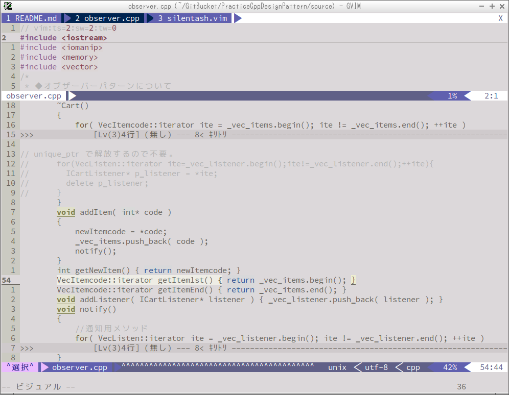

vim Seasons Colorscheme Pack
==========

- はじめに

  これは vim の ColorSchemePack です。

- 利用に関して

  個人的な利用であれば自由に使用していただいて問題ありません。

Screenshots
-----

春はあけぼの。

全体的にピンク系。たまに微かな紫やアクセントの黄色も入れています。

夏は夜。

黒系背景。ややパッとしないかも。

秋は夕暮れ。

春とは逆に黄色系。春と比べて大きく外れる色はありませんが、アクセントに赤を入れています。

冬はつとめて。

全体的に寒色系。Visualモード時など時折りキリッとした青色が入ります。

森

落ち着く緑色系。青系も入れて涼しいイメージも。

灰は灰に。

イメージは電子工作などの小型ディスプレイ。遊びで目立ち過ぎないように色を入れました。

